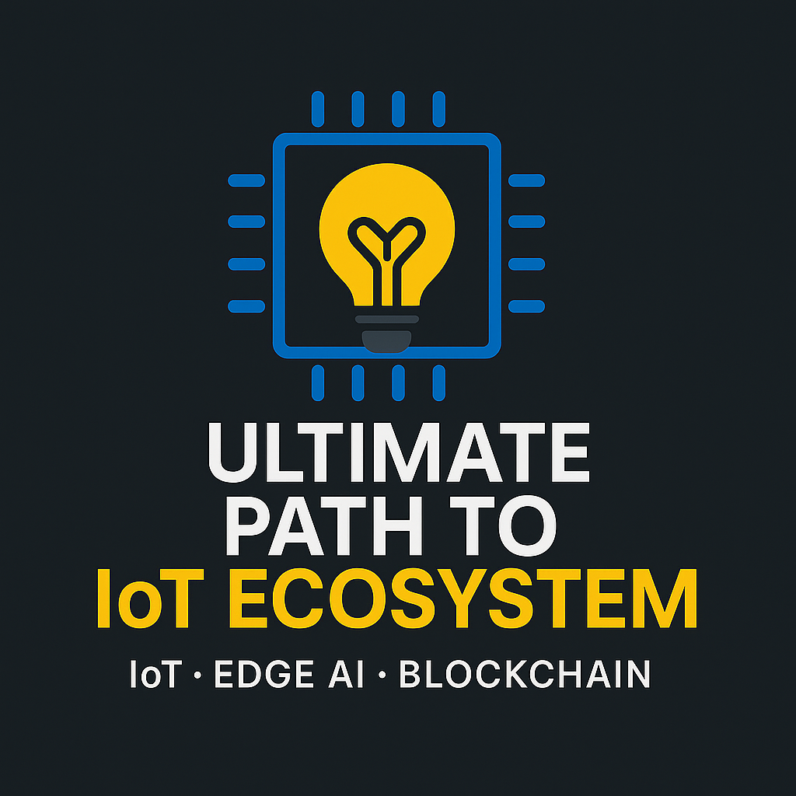

# 🚀 Project Ultimate path to IoT Ecosystem

Welcome to **Ultimate Path To IoT Ecosystem** – an all-encompassing initiative designed to master the core and advanced concepts of IoT, MicroPython, Cybersecurity, Networking, AI, ML, Cloud, Edge, APIs, and more!

---

## 🌟 Project Objective

To build a **secure, scalable, AI-integrated IoT ecosystem** from scratch by mastering:

- ✅ MicroPython & CircuitPython
- ✅ Communication Protocols (MQTT, HTTP, WebSockets)
- ✅ Edge Computing & Edge AI
- ✅ Networking (TCP/IP, DNS, DHCP)
- ✅ Secure API Integrations
- ✅ Cloud + Cloud DB (GCP, AWS)
- ✅ AI, ML, Deep Learning
- ✅ IoT Security & Blockchain
- ✅ Real-time Analytics + Power BI
- ✅ Full Web + Mobile Interfacing

---

## 🧠 Phase 0: Preparation

- [x] Set up GitHub repo ✅
- [x] Add project branding (custom README & logo) ✅
- [x] Initialize guided learning plan ✅
- [x] Personal Branding: `Sounak-107/project-ultimate-path-to-iot-ecosystem` ✅

---

## 🛠️ Tech Stack

- **Microcontrollers:** ESP32, Raspberry Pi Pico W
- **Languages:** Python, JavaScript
- **Cloud:** GCP, Firebase, AWS
- **Frontend:** Angular / React
- **Backend:** FastAPI
- **Database:** MySQL (Cloud SQL)

---

## 🔰 Guided Path Milestones

| Phase   | Focus Area                | Status |
| ------- | ------------------------- | ------ |
| Phase 0 | Repo + Branding Setup     | ✅     |
| Phase 1 | MicroPython + IoT Basics  | 🔜     |
| Phase 2 | Networking + Protocols    | 🔜     |
| Phase 3 | Cloud + API Integration   | 🔜     |
| Phase 4 | DBMS + GCP Cloud SQL      | 🔜     |
| Phase 5 | AI + ML for IoT           | 🔜     |
| Phase 6 | IoT Security + Blockchain | 🔜     |
| Phase 7 | Deployment + Monitoring   | 🔜     |

---

## 🧩 Want to Follow Along?

Join me on my journey on:

- 🔗 [GitHub](https://github.com/Sounak-107/project-ultimate-path-to-IoT-Ecosystem)
- 🔗 [LinkedIn](https://www.linkedin.com/in/sounak-banerjee-innovation?utm_source=share&utm_campaign=share_via&utm_content=profile&utm_medium=android_app)

---

Let’s build the future, one sensor at a time 🛠️

— **Sounak Banerjee**

## License

This project is licensed under the [Apache License 2.0](LICENSE).

Copyright © 2025 Sounak Banerjee
